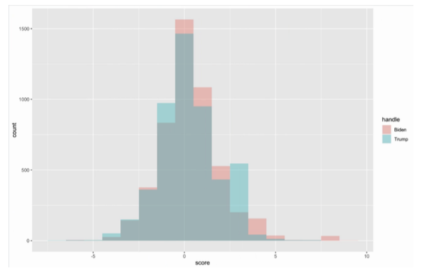

# Sentiment analysis for 10000 tweets for under hastage Joebiden and Donaldtrump
**This is a 7390 group project**
**We are using R**


## Details
**In the day 8/12/2020 We used Twitter API to scrapy 10000 tweets from twitter. `#Donaldtrump` and `#Joebiden` both 5000 tweets by using package called `twitteR`.**


### First what is a `sentiment score`?

The core idea of sentiment scores is to put the number of positive tweets in relation to the number of negative tweets. So the number of sentiment score will be in range of `50% positive` to `50% negative`. 

#### In this `README file` I want to explain some part of our own code.

the df stands for a dataframe, we put both `donaldtrump` and `joebiden` tweets tegether by using `rbind` function in R.

```
temp <- df %>% select(text, handle, hour)
temp$text <- str_replace_all(temp$text, '[^[:alnum:]]',' ')
temp$text = gsub("[[:digit:]]", " ", temp$text)
temp$text = gsub("[ \t]{2,}", " ", temp$text)
temp$line <- seq(from=1, to=dim(temp)[1], by=1)
words <- temp %>%unnest_tokens(word, text)%>%filter(!word %in% stop_words$word,str_detect(word, "^[a-z']+$"))
polar_words <- calculate_score(words$word)
words$polar_words <- polar_words
polar_line <- words %>% group_by(line, handle, hour) %>% summarise(score=sum(polar_words))
```

- Using `select` to select three columns which are `text`, `handle`(contains two vars trump and biden) and `hour` put them into a new dataframe `temp`.

- `gsub` stands for `gloab sub` 

- `Regular Expression` --> `'[^[:alnum:]]'`  , `^` match the beginning of the `string` and `[^[:alnum:]]` is a negated bracket expression that will match any char but an alnum(alphanumeric)char. For example: `'h!toyou!'` -> `'h toyou '`.

- `Regular Expression` --> `'[[:digit:]]'`. We used it to get rid of numbers in our text.

- `Regular Expression` --> `'[ \t]{2,}'` .  We used it to get rid of horizontal tabulation.

- `words <- temp %>%unnest_tokens(word, text)%>%filter(!word %in% stop_words$word,str_detect(word, "^[a-z']+$"))` in this line, we unnest or the words in the column text, and delete or the `stopwords` in `english` and store them into one var called `words`. See the details in https://www.tidytextmining.com/tidytext.html.

- then we calcuate the sentiment score, we also store them into a new column called `polar_words` in our dataframe `words`.


```
# Then we plot the histogram 
ggplot(polar_line, aes(x=score, fill=handle)) + geom_histogram(position = "identity", alpha=0.4, binwidth = 1)
```



```
# Box plot
ggplot(polar_line, aes(x=(handle), y=score)) + geom_boxplot() + 
  stat_summary(fun.y = 'mean', geom = 'point', shape=23, size=3, fill='white')
```


```
# See the sentiment score go by hour
polar_line <- polar_line %>% group_by(handle,hour) %>% summarise(mean_score=mean(score))
ggplot(polar_line, aes(x=hour, y=mean_score, fill=handle)) +
  geom_bar(position="dodge",stat='identity')
```


